# Tugas Digistar Class Hacker Day 4

## Menu

### 1. Beranda

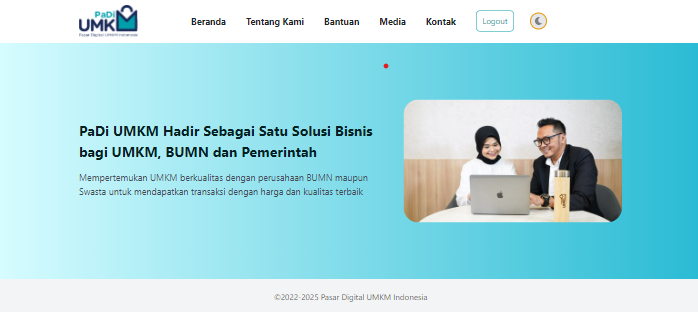
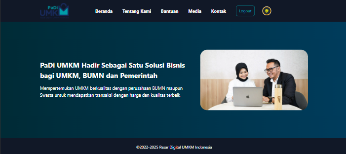

### 2. Tentang Kami

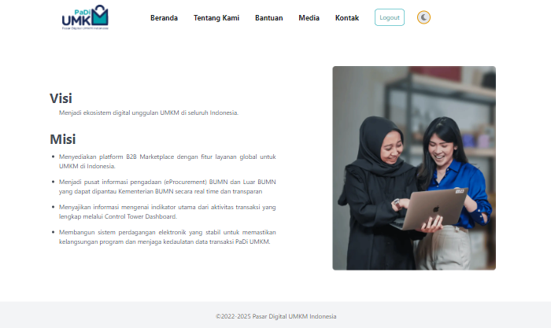
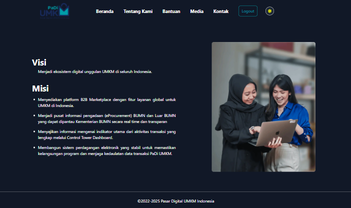

### 3. Bantuan

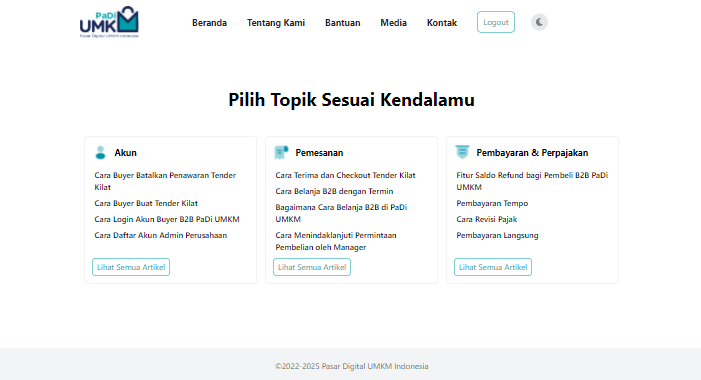
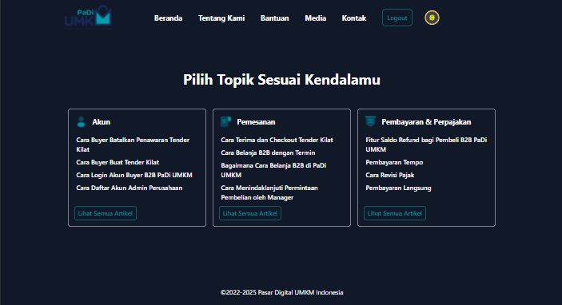

### 4. Media

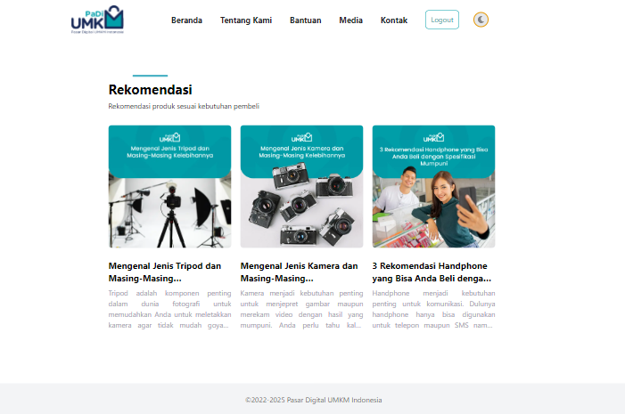
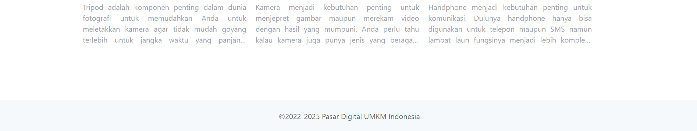
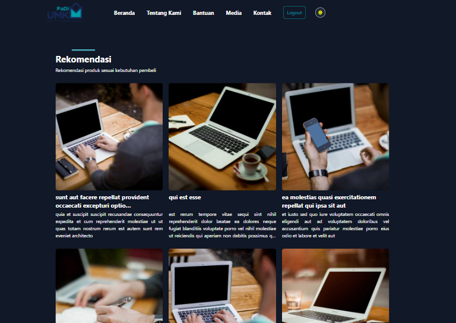
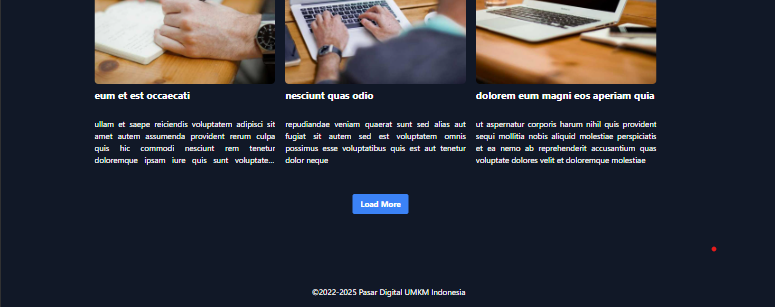

### 5. Kontak

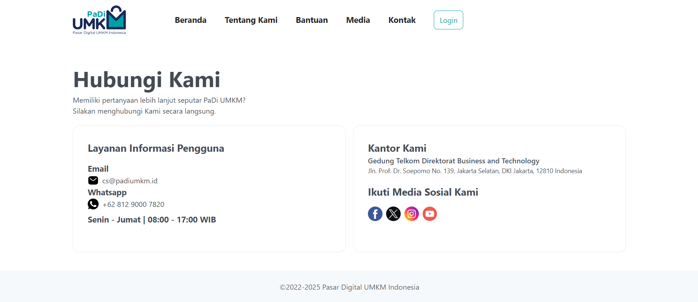
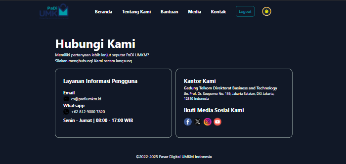

### 6. Login

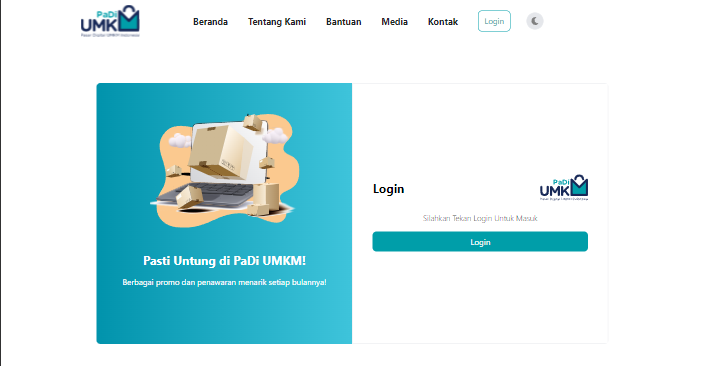
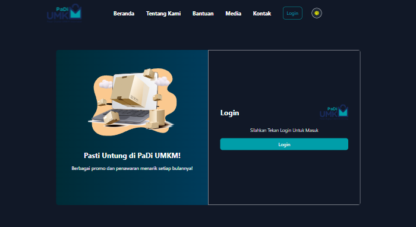

## Available Scripts

In the project directory, you can run:

### `npm run dev`

Runs the app in the development mode.  
Open [http://localhost:5173/](http://localhost:5173) to view it in your browser.

The page will reload when you make changes.  
You may also see any lint errors in the console.
